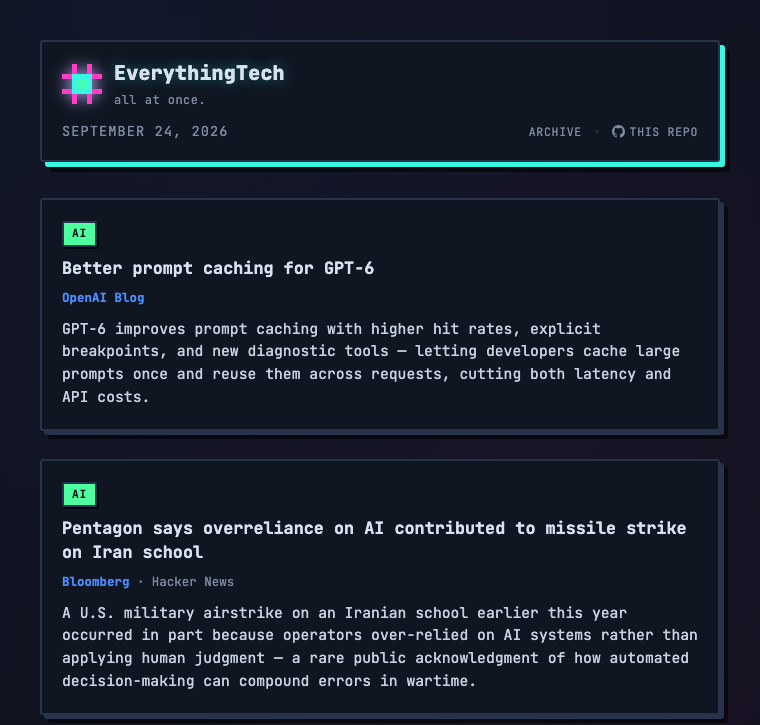

<div align="center">

<br>

# EverythingTech
### all at once.

A daily tech newsletter with no human editor. 47 sources go in, an LLM
reads, dedupes, judges, and ranks them, and a styled static page comes
out — rebuilt every morning by a scheduled Claude Code agent, no server
required.

<a href="https://shubhamcodess.github.io/everything-tech-newsletter/"></a>
<a href="https://github.com/shubhamcodess/everything-tech-newsletter/actions/workflows/ci.yml"></a>


</div>

> The live site shows a placeholder until the routine's first real run —
> `docs/index.html` is deliberately not seeded with fake content. The
> banner above and [`docs/sample-output.html`](https://shubhamcodess.github.io/everything-tech-newsletter/sample-output.html)
> show what real output looks like, assembled by hand from genuine fetched
> data to verify the design before the pipeline was wired up.

---

## What this actually is

Most "AI newsletter" projects are a cron job that calls an LLM API with a
prompt like *"summarize today's tech news"* — vague, unrepeatable, and
billed per run. This isn't that.

- **Fetching and judging are separate concerns.** Deterministic Python
  scripts pull raw articles from every source — no LLM involved, no
  hallucination risk, nothing to hallucinate a headline from. A Claude
  Code agent only sees the *result* of that fetch, and its only job is
  the part that actually needs judgment: filtering, deduping, ranking,
  and writing.
- **No API key, no server, no database.** The agent runs as a
  [Claude Code Routine](https://code.claude.com/docs/en/routines) — a
  scheduled cloud session included with a Claude subscription. It reads
  its instructions from [`CLAUDE.md`](CLAUDE.md), writes a static HTML
  file, and pushes it. [GitHub Pages](https://pages.github.com/) serves
  the result. There is nothing else running, anywhere.
- **Every editorial decision is a file, not a prompt.** Want different
  topics, a bigger digest, or a different set of sources? Edit a JSON
  file and commit. The agent's instructions are versioned, reviewable,
  and diffable like the rest of the code.

## Features

| | |
|---|---|
| 🗞️ **47 sources, zero API keys** | Hacker News, Reddit, arXiv, Dev.to, GitHub Trending, TLDR (tech/AI/dev), and 35 RSS feeds — all free, all public, nothing gated behind a key |
| 🧠 **LLM-judged, not scored** | No weighted formula deciding what's "important" — the agent reads full context and makes the same kind of call a human editor would |
| 🧩 **Duplicate-aware clustering** | The same story covered by five outlets shows once, crediting all five — not five near-identical entries |
| 🎯 **Topic boundary you control** | [`config/interests.json`](config/interests.json) is a plain list of topics — edit it any time, no code change, no redeploy |
| 🔁 **Doesn't repeat itself** | [`data/seen.json`](data/seen.json) tracks recently-featured stories so the same news doesn't resurface for a week |
| 📖 **25 stories, 10 up front** | The rest sit behind a load-more button — no pagination, no reload, just a bit of vanilla JS |
| 🗂️ **Self-pruning archive** | Every day's digest before it's overwritten is snapshotted to `docs/archive/`, capped at the last 7 — old snapshots delete themselves, nothing to clean up by hand |
| 🛡️ **CI that catches breakage early** | Every push validates config and smoke-tests all 47 fetchers, so a bad edit gets caught before the next scheduled run does |
| 🚀 **Deploy is just a push** | GitHub Pages redeploys `docs/` automatically on every push to `main` — no GitHub Action, no build step, the routine just commits |
| 🔀 **Self-merging when it can't push to `main`** | If the routine lands on a `claude/…` branch instead (a protected `main`, most likely), it opens its own PR — it's authenticated as a real account, unlike GitHub Actions' own token — and [`auto-merge-routine.yml`](.github/workflows/auto-merge-routine.yml) merges it once CI passes, no manual click required |
| 🎨 **Self-contained styling** | One template, one `<style>` block, no build step — the whole site is a single static HTML file |

## How it works

```
┌──────────────────────────────────────────────────────┐
│                      47 sources                      │
│              RSS · APIs · HTML scrapes               │
└──────────────────────────────────────────────────────┘
                            │  scripts/fetch_all.py
                            ▼
┌──────────────────────────────────────────────────────┐
│                 data/raw_latest.json                 │
│           (normalized, unjudged articles)            │
└──────────────────────────────────────────────────────┘
                            │
                            ▼
┌──────────────────────────────────────────────────────┐
│        Claude Code routine  (reads CLAUDE.md)        │
│                                                      │
│  1. filter   -> config/interests.json                │
│  2. cluster  -> same-story coverage                  │
│  3. dedupe   -> data/seen.json                       │
│  4. rank     -> judgment + diversity cap             │
│  5. archive  -> docs/archive/ (7-day cap)            │
└──────────────────────────────────────────────────────┘
                            │  writes, using templates/digest.html.template
                            ▼
┌──────────────────────────────────────────────────────┐
│                   docs/index.html                    │
└──────────────────────────────────────────────────────┘
                            │  git commit + push
                            ▼
┌──────────────────────────────────────────────────────┐
│          GitHub Pages  (auto-deploys /docs)          │
└──────────────────────────────────────────────────────┘
```

Two things never touch each other in this pipeline: the **fetch** step
(step 1–2, plain HTTP/deterministic parsing) and the **judgment** step
(step 3 onward, the LLM). That split is what makes the output
inspectable — `data/raw_latest.json` shows you exactly what the agent
saw before it made a single editorial decision.

## Sources

<details>
<summary><strong>All 47 sources, by fetch method</strong> (click to expand)</summary>

| Method | Count | Examples |
|---|---|---|
| Official API | 9 | Hacker News (Algolia), Reddit, arXiv, Dev.to |
| RSS/Atom feed | 35 | TechCrunch, Ars Technica, InfoQ, Kubernetes Blog, Simon Willison, Lobsters, … |
| HTML scrape | 4 | GitHub Trending, TLDR (tech/AI/dev editions) |

Full list with trust tiers and categories: [`config/sources.json`](config/sources.json).
Three Reddit sources are known to 403 outside the routine's cloud IP —
documented in-line in the config, not a bug.

</details>

## Configuration

Nothing below needs a code change or a redeploy — edit the file, commit,
push. The next scheduled run picks it up.

| File | Controls | Example |
|---|---|---|
| [`config/interests.json`](config/interests.json) | The topic whitelist. Articles outside it are filtered out before anything else happens. | `["AI / LLMs", "security", "open source"]` |
| [`config/settings.json`](config/settings.json) | Digest size, lookback windows, timezone. | `"articles_per_digest": 25` |
| [`config/sources.json`](config/sources.json) | The source registry — add, remove, or disable a source. RSS sources need only a `feed_url`. | `{"type": "rss", "feed_url": "..."}` |
| [`templates/digest.html.template`](templates/digest.html.template) | The page's visual design — theme, layout, load-more behavior. | — |
| [`templates/archive.html.template`](templates/archive.html.template) | The past-digests listing page. | — |
| [`CLAUDE.md`](CLAUDE.md) | The agent's actual pipeline instructions, step by step. | — |

## Project structure

```
.
├── CLAUDE.md                       # the agent's pipeline, step by step
├── ROUTINE_PROMPT.md               # what's pasted into the routine's prompt box
├── SETUP.md                        # one-time setup: repo, Pages, routine
├── .github/workflows/
│   ├── ci.yml                      # validates config + smoke-tests fetchers
│   └── auto-merge-routine.yml      # merges the routine's own claude/* PRs once CI passes
├── config/
│   ├── interests.json              # topic whitelist
│   ├── settings.json               # digest size, lookback windows
│   └── sources.json                # the 47-source registry
├── scripts/
│   ├── fetch_all.py                # orchestrator
│   ├── fetch_rss.py                # generic RSS/Atom fetcher
│   ├── fetch_hn.py                 # Hacker News (Algolia API)
│   ├── fetch_reddit.py             # Reddit (public .json endpoints)
│   ├── fetch_arxiv.py              # arXiv (Atom API)
│   ├── fetch_devto.py              # Dev.to (public API)
│   ├── fetch_github_trending.py    # GitHub Trending (HTML scrape)
│   └── fetch_tldr.py               # TLDR editions (HTML scrape)
├── templates/
│   ├── digest.html.template        # the digest's structure + styling
│   └── archive.html.template       # the archive listing page
├── data/
│   └── seen.json                   # memory of recently-featured stories
└── docs/                           # GitHub Pages source (branch deploy)
    ├── index.html                  # today's digest
    └── archive/
        ├── index.html              # past-digests list, capped at 7 days
        └── YYYY-MM-DD.html         # one snapshot per archived day
```

## Setup

1. Enable GitHub Pages: **Settings → Pages → Deploy from a branch → `main`, `/docs`** (GitHub's branch-based Pages deploy only supports root or `/docs`, which is why the site publishes from there)
2. Create a [Claude Code Routine](https://code.claude.com/docs/en/routines) pointed at this repo, on a daily schedule
3. Set the routine's environment network access to **Custom** with the domain allowlist in [`SETUP.md`](SETUP.md) — none of these sources are in the default trusted list
4. Paste [`ROUTINE_PROMPT.md`](ROUTINE_PROMPT.md) as the routine's prompt

Full walkthrough, including *why* each step is needed: [`SETUP.md`](SETUP.md).

## Tech stack

<div align="left">


</div>

No frontend framework, no build step, no database — `feedparser` and
`requests` do the fetching, an LLM does the judgment, and the output is
one HTML file with an inline `<style>` block.

---

<div align="center">

**$** curated_by **Shubham Prakash**

<a href="https://github.com/shubhamcodess"></a>
<a href="https://www.linkedin.com/in/shubham-prakash-dev/"></a>

</div>
